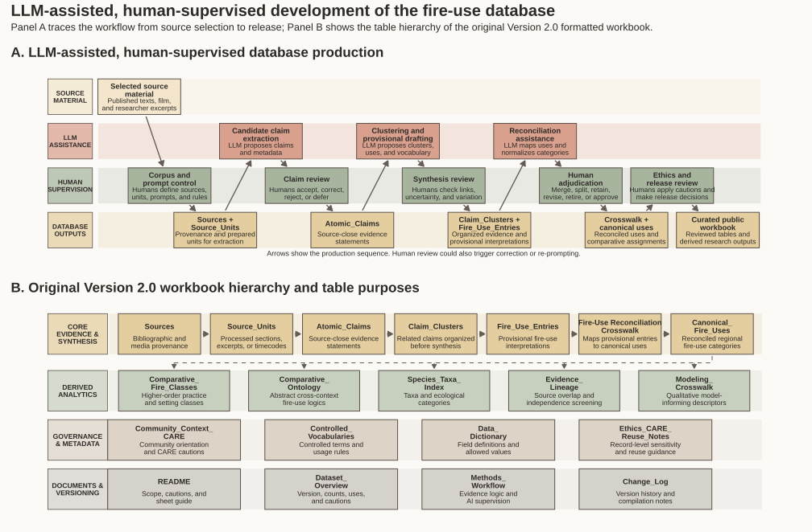
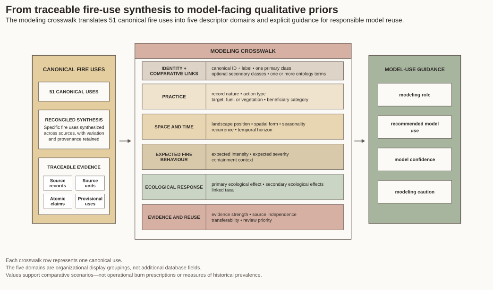
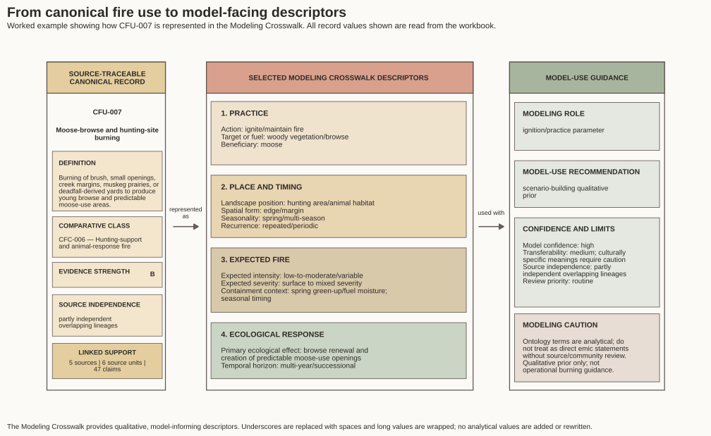

## Project overview

This project transforms information from ethnographic literature on Indigenous fire practices in northern Alberta into a structured, traceable, and model-oriented dataset.

## My role

- Reviewed and structured ethnographic source material
- Developed source units and evidence-based claims
- Applied controlled vocabularies
- Connected claims to fire-use entries and comparative categories
- Prepared model-facing variables
- Conducted quality assurance and public-data cleaning
- Created documentation and visualizations

## Dataset structure

\[Add a concise explanation and a selected image or diagram here.\]

## Database Design and Research Workflow

This figure summarizes how source material was transformed into a structured and reviewable database. It distinguishes source material, LLM-assisted processing, human supervision, and resulting database outputs. The second panel shows the relationships and purposes of the Version 2.0 workbook tables.

::: {.column-screen-inset}

[{.static-preview .research-figure-preview fig-alt="Two-panel diagram showing the human-supervised and LLM-assisted development workflow and table structure of the Version 2.0 fire-use database"}](images/figures/fire-database-workflow.svg){target="_blank"}

:::

::: {.figure-note}
**Dataset:** Fire-use database Version 2.0, developed by Matthew Walls and Nicholas Giardina. **Figure:** Nicholas Giardina.
:::

::: {.portfolio-actions}
[Open full-size figure](images/figures/fire-database-workflow.svg){.btn .btn-primary target="_blank"}

[Download PDF](files/figures/fire-database-workflow.pdf){.btn .btn-outline-secondary target="_blank"}
:::

**My role:** I helped develop, clean, and validate the relational database and produced this figure in R to communicate its workflow and table structure.

**Skills demonstrated:** Relational data organization, evidence traceability, data quality control, responsible use of LLM-assisted methods, workflow documentation, and technical visualization.

---

## Model-Facing Data Architecture

The Modeling Crosswalk translates 51 source-traceable canonical fire uses into qualitative descriptors that can support comparative research and responsible model development. The figure organizes those descriptors into practice, space and time, expected fire behaviour, ecological response, and evidence and reuse.

::: {.column-screen-inset}

[{.static-preview .research-figure-preview fig-alt="Diagram showing how 51 canonical fire uses connect through the Modeling Crosswalk to model-use guidance"}](images/figures/model-facing-architecture.svg){target="_blank"}

:::

::: {.figure-note}
**Source:** Fire-use database Version 2.0. **Figure:** Nicholas Giardina.
:::

::: {.portfolio-actions}
[Open full-size figure](images/figures/model-facing-architecture.svg){.btn .btn-primary target="_blank"}

[Download PDF](files/figures/model-facing-architecture.pdf){.btn .btn-outline-secondary target="_blank"}
:::

**My role:** I helped structure and validate the model-facing variables and created this figure to explain how evidence-based cultural information is translated into cautious qualitative modeling descriptors.

**Skills demonstrated:** Data modeling, variable design, qualitative data transformation, research communication, visual hierarchy, and responsible model-use documentation.

---

## Worked Crosswalk Example

This worked example shows how one canonical fire-use record is represented in the Modeling Crosswalk. CFU-007 is supported by five sources, six source units, and 47 linked claims.

::: {.column-screen-inset}

[{.static-preview .research-figure-preview fig-alt="Worked example showing how CFU-007 Moose-browse and hunting-site burning is represented using model-facing descriptors"}](images/figures/model-facing-example.svg){target="_blank"}

:::

::: {.figure-note}
**Record:** CFU-007, Moose-browse and hunting-site burning. **Source:** Fire-use database Version 2.0. **Figure:** Nicholas Giardina.
:::

::: {.portfolio-actions}
[Open full-size figure](images/figures/model-facing-example.svg){.btn .btn-primary target="_blank"}

[Download PDF](files/figures/model-facing-example.pdf){.btn .btn-outline-secondary target="_blank"}
:::

This example demonstrates how the database retains source support, evidence strength, and cautions while making selected information usable for qualitative modeling scenarios.

## Research and data challenges

\[Discuss evidence traceability, uncertainty, interpretation, cultural context, and the creation of the public-cleaned version here.\]

## Skills demonstrated

- Research data production
- Relational data organization
- Controlled vocabulary development
- Evidence traceability
- Data quality assurance
- Research documentation