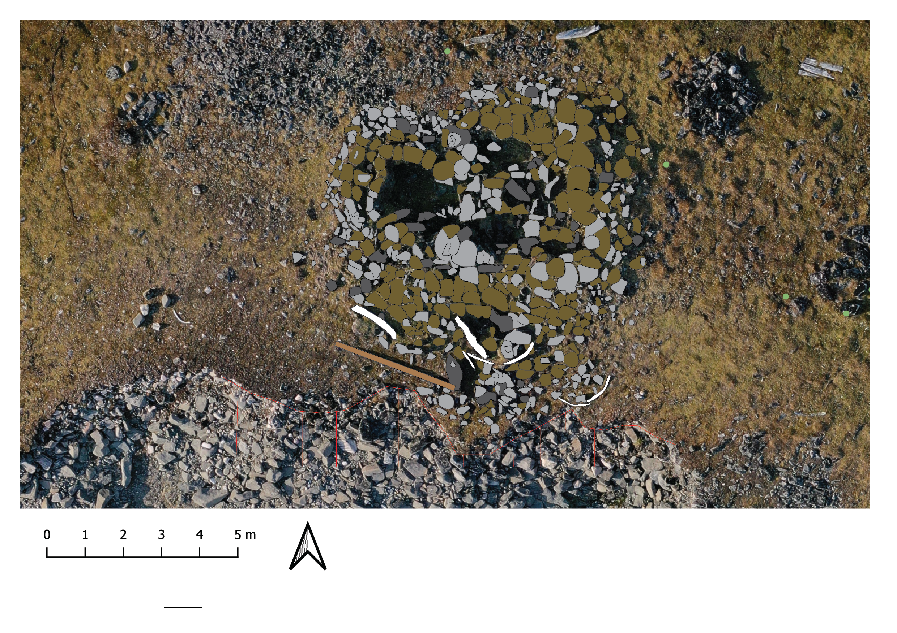
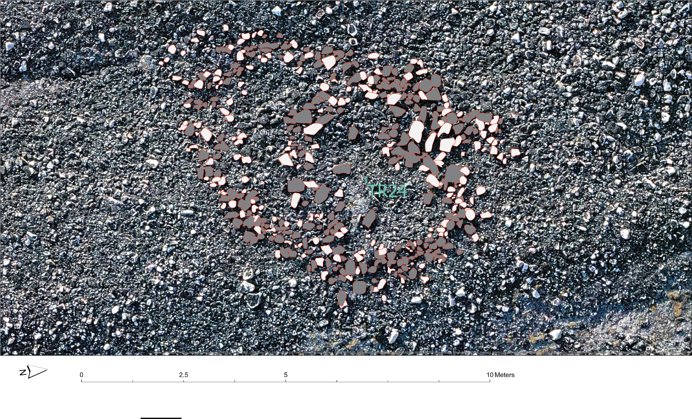

## Kitsissut: Lethbridge Hut 1

This archaeological illustration documents the visible form and features of Lethbridge Hut 1 at Kitsissut based on aerial imagery.

[{.static-preview .illustration-preview fig-alt="Completed archaeological illustration of Lethbridge Hut 1 at Kitsissut, based on aerial imagery"}](images/illustrations/lethbridge-hut-1-final.png){target="_blank"}

::: {.portfolio-actions}

[Open full-size completed illustration](images/illustrations/lethbridge-hut-1-final.png){.btn .btn-primary target="_blank"}

:::

**My role:** I used aerial imagery as a reference to draw the archaeological feature in Adobe Illustrator and produce a clear, finished vector illustration.

**Skills demonstrated:** Adobe Illustrator, interpretation of aerial imagery, precise vector drawing, feature differentiation, visual hierarchy, labeling, and preparation of publication-quality archaeological graphics.

**Source and context:** Produced from aerial imagery supplied as reference material for documenting archaeological features at Kitsissut.

View an earlier working version

<a href="files/illustrations/process/lethbridge-hut-1-before.pdf"
   target="_blank"
   rel="noopener">
Open earlier working version (PDF)
</a>

---

## Kitsissut: Tent Ring 24

This archaeological illustration documents the layout and visible features of Tent Ring 24 at Kitsissut based on aerial imagery.

[{.static-preview .illustration-preview fig-alt="Completed archaeological illustration of Tent Ring 24 at Kitsissut, based on aerial imagery"}](images/illustrations/tent-ring-24-final.png){target="_blank"}

::: {.portfolio-actions}

[Open full-size completed illustration](images/illustrations/tent-ring-24-final.png){.btn .btn-primary target="_blank"}

:::

**My role:** I used aerial imagery as a reference to draw the archaeological feature in Adobe Illustrator and produce a clear, finished vector illustration.

**Skills demonstrated:** Adobe Illustrator, interpretation of aerial imagery, precise vector drawing, feature differentiation, visual hierarchy, and preparation of publication-quality archaeological graphics.

**Source and context:** Produced from aerial imagery supplied as reference material for documenting archaeological features at Kitsissut.

View an earlier working version

<a href="images/illustrations/process/tent-ring-24-before.jpg"
   target="_blank"
   rel="noopener">
Open earlier working version (JPEG)
</a>

