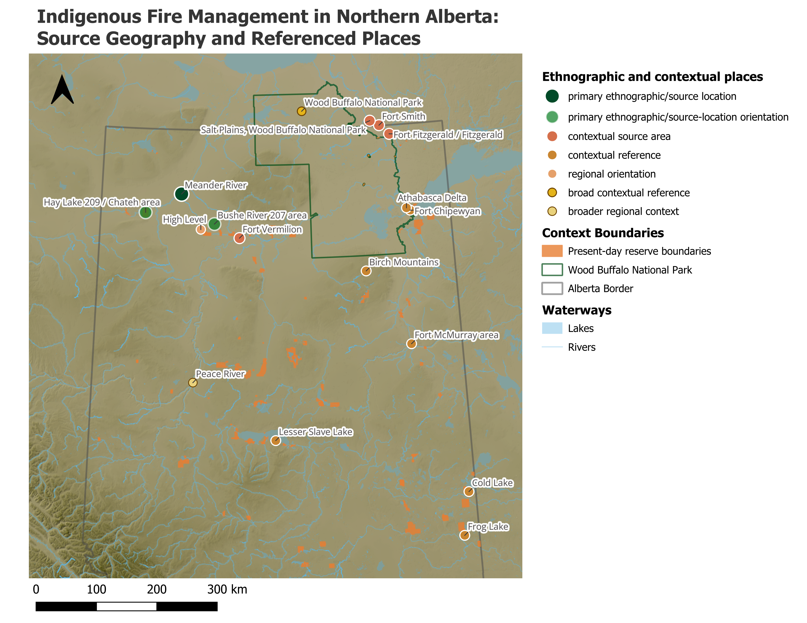
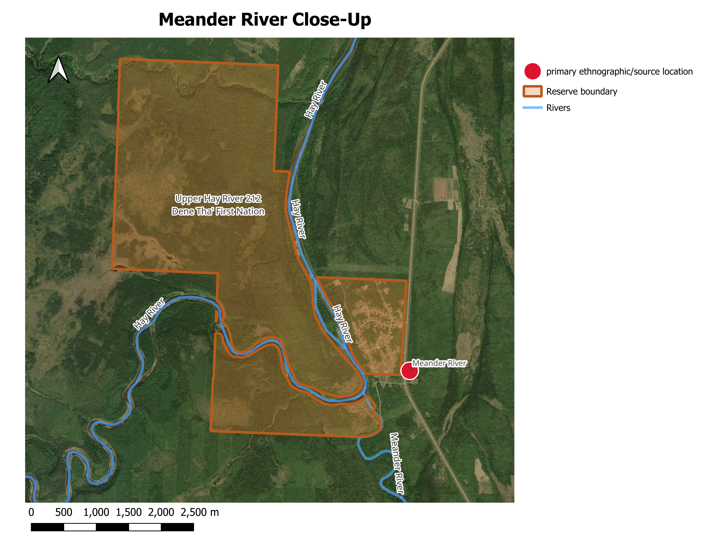

## Regional Fire-Use Research Map

This regional map situates the communities, ethnographic source locations, contextual places, waterways, and administrative boundaries relevant to the northern Alberta fire-use research.

[{.static-preview .map-preview fig-alt="Regional map showing locations and geographic context associated with the northern Alberta Indigenous fire-use research"}](images/maps/regional-fire-map.png){target="_blank"}

::: {.map-credit}

**CRS:** NAD83(CSRS) / Alberta 10-TM (Forest) (EPSG:3402).

**Sources:** [Government of Alberta / Alberta Data Partnerships Ltd.](https://app.geo.ca/en-ca/map-browser/record/79671bf3-706a-47df-9ebd-d4789ce957e8) (reserve boundaries); [Parks Canada](https://parks.canada.ca/pn-np/nt/woodbuffalo/visit/brochures) (Wood Buffalo National Park boundary); [Natural Resources Canada, Canada3D](https://app.geo.ca/en-ca/map-browser/record/042f4628-94b2-40ac-9bc1-ca3ac2a27d82) (elevation and derived hillshade); [© OpenStreetMap contributors](https://www.openstreetmap.org/copyright) (Alberta boundary, rivers, and lakes), ODbL. Source and contextual locations compiled by Matthew Walls primarily from project source literature. Cartography by Nicholas Giardina.

:::

::: {.portfolio-actions}

[Open full-size map](images/maps/regional-fire-map.png){.btn .btn-primary target="_blank"}

[Download credited PDF](files/maps/regional-fire-map-credited.pdf){.btn .btn-outline-secondary target="_blank"}

:::

**My role:** I designed and produced this map in QGIS to communicate the geographic context of the ethnographic fire-use dataset.

**Skills demonstrated:** Coordinate reference system management, spatial data organization, cartographic hierarchy, symbology, labeling, print-layout design, and export preparation.

**Design approach:** Places directly associated with the source material are visually distinguished from broader contextual locations and boundaries. The map balances regional orientation with the visibility of communities, waterways, and the Wood Buffalo National Park context.

---

## Meander River Close-Up Map

This close-up map provides more detailed geographic context for Meander River and the surrounding landscape discussed in the research sources.

[{.static-preview .map-preview fig-alt="Close-up map of Meander River and its surrounding geographic context"}](images/maps/meander-river-close-up-map.png){target="_blank"}

::: {.map-credit}

**CRS:** NAD83(CSRS) / Alberta 10-TM (Forest) (EPSG:3402).

**Sources:** [Government of Alberta / Alberta Data Partnerships Ltd.](https://app.geo.ca/en-ca/map-browser/record/79671bf3-706a-47df-9ebd-d4789ce957e8) (reserve boundary); [© OpenStreetMap contributors](https://www.openstreetmap.org/copyright) (rivers), ODbL. Imagery: [Esri World Imagery](https://www.arcgis.com/home/item.html?id=974d45be315c4c87b2ac32be59af9a0b), Vantor WorldView-3 (WV03), acquired 17 June 2025. Source and contextual locations compiled by Matthew Walls primarily from project source literature. Cartography by Nicholas Giardina.

:::

::: {.portfolio-actions}

[Open full-size map](images/maps/meander-river-close-up-map.png){.btn .btn-primary target="_blank"}

[Download credited PDF](files/maps/meander-river-close-up-map-credited.pdf){.btn .btn-outline-secondary target="_blank"}

:::

**My role:** I designed this close-up map in QGIS to complement the regional map with a more localized view.

**Skills demonstrated:** Multi-scale cartographic design, basemap integration, hydrology display, label placement, visual hierarchy, and print-layout production.

**Design approach:** The map retains enough surrounding landscape context to orient the viewer while focusing attention on Meander River and the locally relevant features.