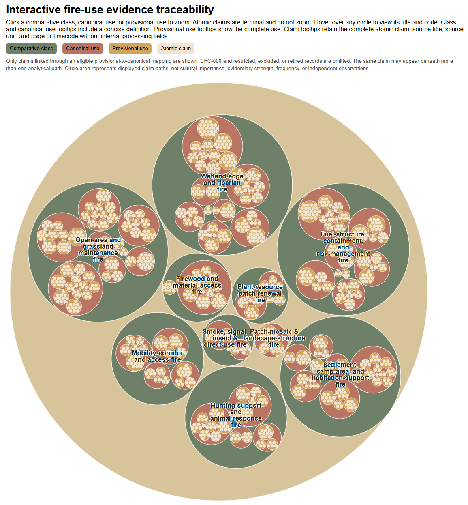
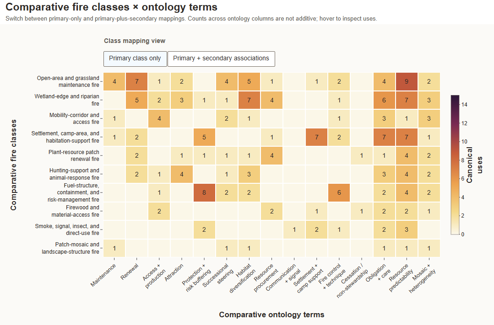
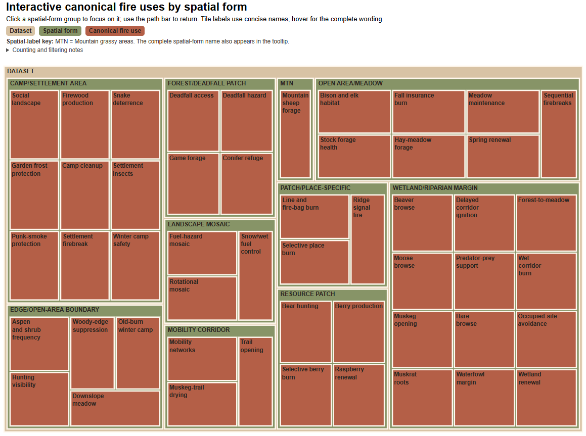
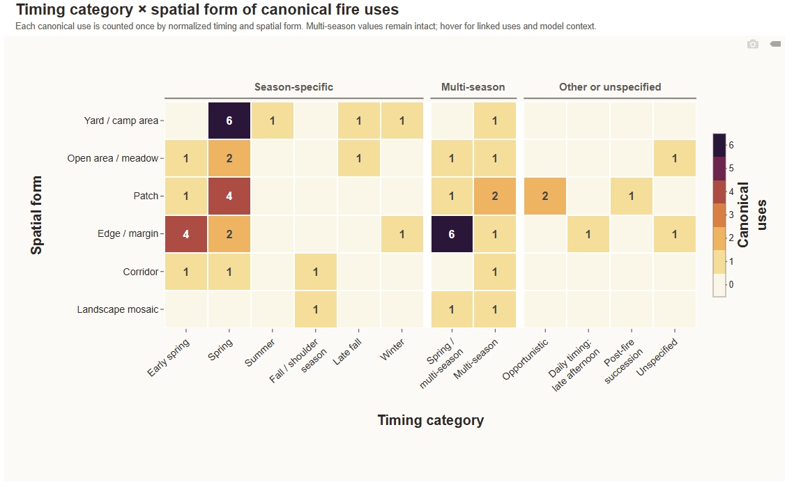

These interactive figures were developed in R to communicate the structure, evidence relationships, and model-facing characteristics of the ethnographic fire-use dataset. Select a preview to open the complete interactive visualization.

:::: {.visualization-grid}

::: {.visualization-card}

## Evidence Traceability Circle Pack

[{.visualization-preview .circlepack-thumbnail fig-alt="Preview of the interactive evidence traceability circle pack"}](viz-circlepack.qmd)

This visualization communicates relationships among evidence records, comparative fire classes, canonical fire uses, provisional uses, and supporting atomic claims.

[Explore the circle pack](viz-circlepack.qmd){.btn .btn-primary}

:::

::: {.visualization-card}

## Comparative Class and Ontology Heatmap

[{.visualization-preview fig-alt="Preview of the interactive comparative fire class and ontology heatmap"}](viz-ontology-heatmap.qmd)

This heatmap compares comparative fire classes across selected ontology and model-facing variables, with alternate views for primary and secondary associations.

[Explore the ontology heatmap](viz-ontology-heatmap.qmd){.btn .btn-primary}

:::

::: {.visualization-card}

## Spatial-Form Treemap

[{.visualization-preview fig-alt="Preview of the interactive canonical fire-use spatial-form treemap"}](viz-spatial-treemap.qmd)

This treemap communicates how canonical fire uses are distributed among normalized spatial forms and related categories.

[Explore the spatial-form treemap](viz-spatial-treemap.qmd){.btn .btn-primary}

:::

::: {.visualization-card}

## Timing and Spatial-Form Heatmap

[{.visualization-preview fig-alt="Preview of the interactive timing category and spatial-form heatmap"}](viz-timing-spatial.qmd)

This heatmap explores relationships between documented timing regimes and the spatial forms of canonical fire uses.

[Explore the timing heatmap](viz-timing-spatial.qmd){.btn .btn-primary}

:::

::::